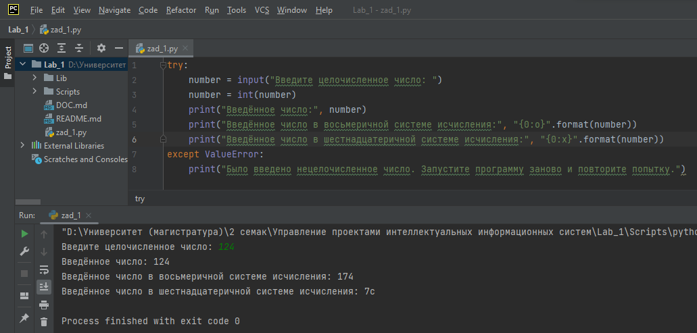
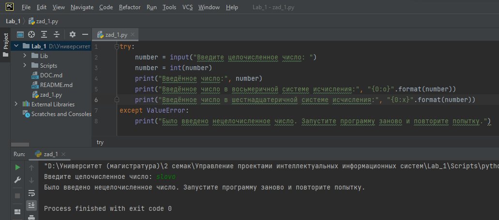
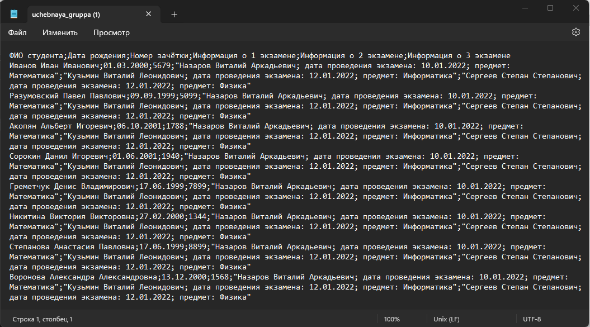
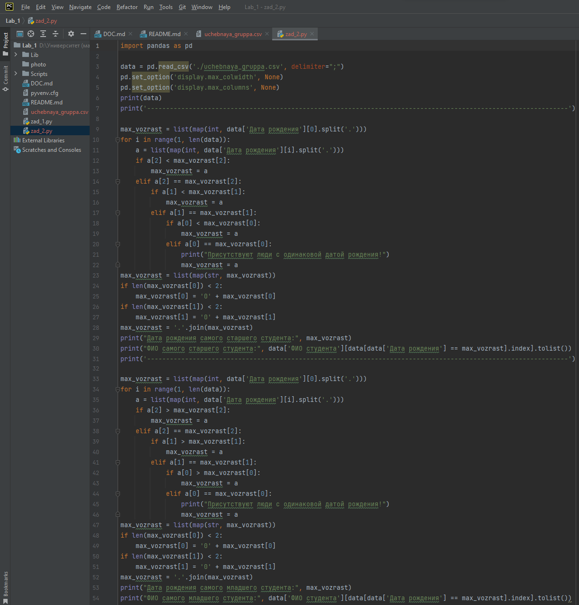
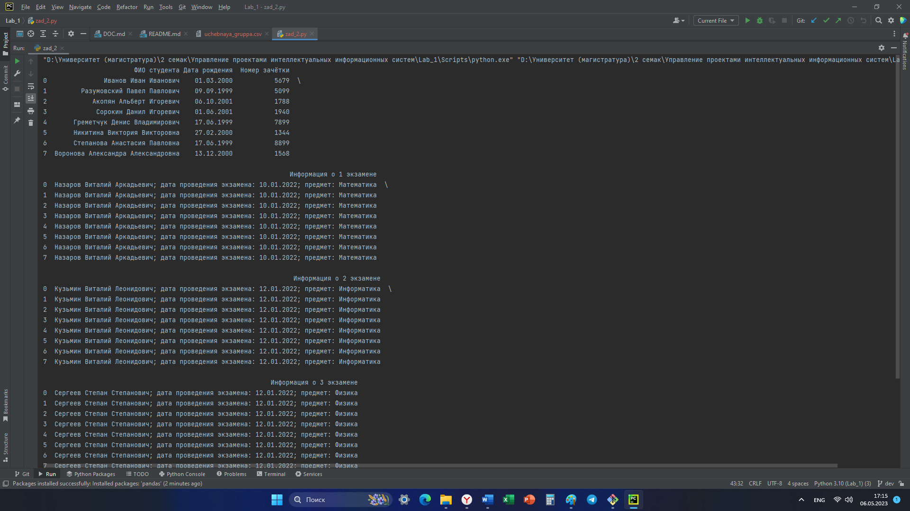
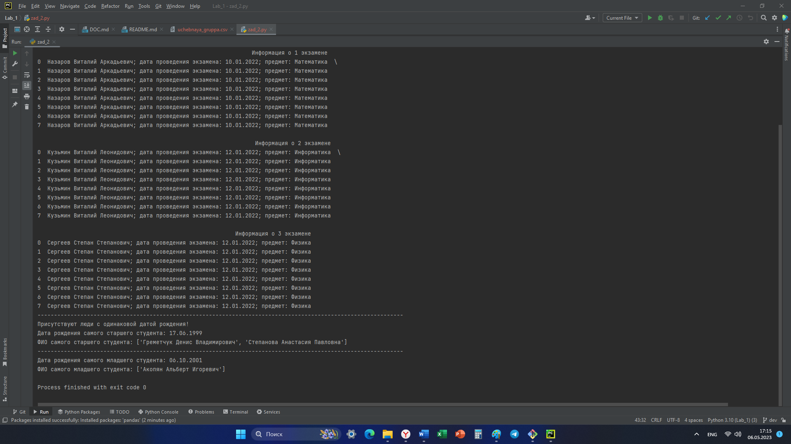

# Лабораторная работа №1 по дисциплине "Управление проектами интеллектуальных информационных систем"
Выполнил студент РТУ МИРЭА группы ББМО-01-22 Кузькин Павел Александрович.
## Описание 1 задания
В данном задании было необходимо написать функцию, которая принимает в качестве аргумента целочисленное число и выводит его представление в восьмеричной и шестнадцатиричной системе исчисления.

Пример кода, который удовлетворяет требованиям задания 1, представлен на рисунках 1 и 2. На первом рисунке с консоли было введено целочисленное число, а на втором рисунке показано как ведёт себя программа, если ввести что-то другое, например, латинские букты.

Рисунок 1 - Результат работы кода, если ввести целочисленное число

Рисунок 2 - Результат работы кода, если ввести латинские буквы
## Описание 2 задания
В данном задании заранее был подготовлен файл, в котором содержится информация о студентах (ФИО, дата рождения, номер зачётки) и о экзаменах (ФИО преподавателя, дата проведения, название дисциплины). Содержимое файла представлено на рисунке 3.

Рисунок 3 - Содержимое файла uchebnaya_gruppa.csv

Далее был разработан код (рис. 4), который позволяет выполнить требования изложенные во 2 задании (необходимо вывести ФИО и дату рождения самого младшего и старшего студента). Результат интерпритации кода представлен на рисунках 5 и 6.

Рисунок 4 - Демонстрация кода, который удовлетворяет заданию 2

Рисунок 5 - Результат интерпритации кода (консольный вывод 1)

Рисунок 6 - Результат интерпритации кода (консольный вывод 2)
